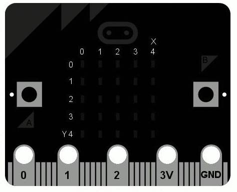

# 🎉 Scrolling Text for micro:bit
 
Make a tiny computer say hello! This project scrolls a personal greeting across the LED display of a **BBC micro:bit**, using just a few lines of Python.
 
> **Hello my name is David!** ← change it to your own name in 10 seconds.
 
<p align="center">
  
</p>

 
---
 
## 🤔 What is a micro:bit?
 
The [micro:bit](https://microbit.org/) is a pocket-sized computer designed for learning to code. It was created by the BBC and is used in schools all over the world. Despite its small size (about the size of a credit card), it has a lot built in:
 
| Feature | What it does |
|---|---|
| 5×5 LED display | Shows text, numbers \and little pictures (25 tiny red lights) |
| Buttons A and B | Lets you react to button presses |
| Accelerometer | Notices movement, shaking and tilting |
| Compass | Knows which direction you are facing |
| Temperature sensor | Measures the temperature around it |
| Radio and Bluetooth | Talks to other micro:bits or to your phone |
| Gold pins (0, 1, 2, 3V, GND) | Connect lights, motors, sensors and more |
 
Newer versions (V2) also have a **speaker**, a **microphone** and a **touch-sensitive logo**.
 
##  You can get it in.
 
- **Official shop list:** [microbit.org/buy](https://microbit.org/buy/) shows authorised sellers for your country.
- Many electronics shops and online stores sell them, often in a **starter kit** with a battery pack and USB cable. Prices change, so compare a few shops.
- Tip: choose the **V2** version if you 
  can. It has more features, and everything in this project works on both versions.
## You need
 
- A BBC micro:bit
- A USB cable that can transfer **data** (some cables only charge!)
- [Python 3](https://www.python.org/downloads/)
- [Git](https://git-scm.com/downloads)
- [Visual Studio Code](https://code.visualstudio.com/) (recommended)
##  Quick start
 
1. **Download the project**
```
   git clone https://github.com/davidgallitz-debug/scrolling-text.git
   cd scrolling-text
```
2. **Create a virtual environment** (a private box for this project's libraries)
```
   python -m venv venv
```
3. **Activate it** (Windows PowerShell)
```
   .\venv\Scripts\Activate.ps1
```
   On macOS/Linux use `source venv/bin/activate` instead.
4. **Install the libraries**
```
   pip install -r requirements.txt
```
 
##  Use your own name
 
1. Open `main.py` and change this line:
```python
   name = "David"
```
   to
```python
   name = "Your Name"
```
2. Plug in your micro:bit with the USB cable.
3. Send the program to the micro:bit:
```
   uflash main.py
```
4. Watch your name scroll across the display! ✨

 
You can find all built-in images (like `Image.HAPPY`, `Image.SAD` or `Image.GHOST`) in the [micro:bit Python documentation](https://microbit-micropython.readthedocs.io/en/v2-docs/).
 
## 🛠️ Troubleshooting
 
| Problem | Solution |
|---|---|
| `uflash` cannot find the micro:bit | Try another USB cable. Many cables only charge and do not transfer data. |
| The micro:bit is not shown as a drive | Unplug it and plug it in again. It should appear as a drive called `MICROBIT`. |
| `python` is not recognized | Install Python from [python.org](https://www.python.org/downloads/) and tick **"Add Python to PATH"**. |
| PowerShell blocks the activate script | Run `Set-ExecutionPolicy -Scope CurrentUser RemoteSigned` once, then try again. |
 
##  Project files
 
| File | Purpose |
|---|---|
| `main.py` | The program that runs on the micro:bit |
| `requirements.txt` | The Python libraries this project needs |
| `.gitignore` | Tells Git which files to ignore (e.g. `venv/`) |
| `images/` | Pictures used in this README |
 
## 🔗 Useful links
 
- [micro:bit official website](https://microbit.org/)
- [Online Python editor](https://python.microbit.org/) (code without installing anything)
- [MakeCode editor](https://makecode.microbit.org/) (block-based coding, great for beginners)
- [micro:bit MicroPython documentation](https://microbit-micropython.readthedocs.io/)
- [uflash on PyPI](https://pypi.org/project/uflash/)
## 🙌 Credits
 
The micro:bit picture is taken from the micro:bit documentation. micro:bit is a trademark of the Micro:bit Educational Foundation.
 
---
 
Made with ❤️ by David.